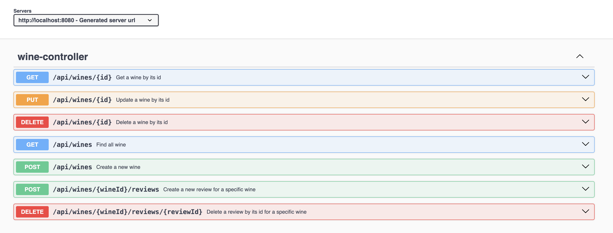

# Les amis de la maison du vin

Nous avons décroché un nouveau contrat pour notre academy. 🎉💸  
`AmyWineHouse company` veut ouvrir leurs services en France sous le nom de : `Les amis de la maison du vin`.

`Les amis de la maison du vin` permettra à terme de :

- **fournir un catalogue de vins** (géré par les administrateurs) avec recherche
- permettre aux **utilisateurs de poster des avis sur les vins qu'ils préfèrent**

Les vins seront ajoutés via des requêtes depuis un client HTTP (Insomnia ou Postman).  
Les avis pourront eux être saisis directement depuis le Front (fonctionnalité à venir).

L'application est un tout nouveau projet (feuille blanche ou from scratch).
Mais nous allons pouvoir récupérer des informations sur l'application existante (version statique HTML / CSS / JS).

Pas de contrainte sur la charte graphique, mais vous pouvez récupérer le front de l'application en HTML / CSS /
JS [ici](https://drive.google.com/drive/u/1/folders/1X5KszjgbXPkDjbPoOOvTH8U43tiQ1JPz).  
Sentez-vous libre de changer ce que vous voulez **tant que les fonctionnalités demandées sont là**.

Nous allons devoir développer les différentes parties de cette nouvelle application (pas tous en un jour ;)) :

- Une serveur API Rest en Java / Spring boot
- Un client en Angular
- Un script de déploiement via Gitlab Ci / CD
- Un script docker-compose pour faciliter la création de la stack
- Une base de données (SQL)

## 1er chapitre - L'API Rest

L'api Rest doit être développée en **Java + Spring Boot**.

Cette API doit fournir deux modèles de données (ressources) :

- Wine (représente une bouteille de vin)
- Review (représente un avi sur une bouteille de vin)

**Objectifs**

- [ ] Un modèle représentant la ressource `Wine`
- [ ] Un modèle représentant la ressource `Review`
- [ ] Un CRUD pour la ressource `Wine`
- [ ] Un CD pour la ressource `Review`
- [ ] La validation des ressources devra être faite dans la couche contrôleur

Les différents EndPoints devront suivre le nommage suivant :

On ajoute des avis à un vin, d'où le passage par les urls :

- POST `/wines/{id}/reviews` pour l'ajout
- DELETE `/wines/{id}/reviews/{id}` pour la suppression

Si vous avez des questions, n'hésitez pas à les poser au Product Owner (formateur).

### Modèle Wine

La réprésentation de la ressource `Wine` devra contenir les informations suivantes :

- `ìd` un entier **unique** représentant l'identifiant de la ressource
- `name` le nom du vin
- `estate` le nom du domaine
- `appellation` le nom de l'appellation (Gigondas, Mouton Cadet ...)
- `description` description du vin par le vendeur
- `price` une valeur décimale représentant le prix en euros
- `alcoholPercentage` une valeur décimale représentant le degré d'alcool du vin
- `region` la région d'où provient le vin (Bordelais, Vallée du Rhône ...)
- `year` l'année de production du vin
- `colour` la couleur du vin (rouge, blanc ou rosé)
- `grapeVarieties` les cépages du vin (Syrah, Merlot, Sauvignon ...)
- `reviews` les avis postés par les utilisateurs sur le vin

**Contraintes :**

- Les données sont toutes obligatoires sauf la description et le domaine du vin.
- L'id sera généré par l'api et ne doit pas pouvoir être inséré ou modifié par les clients.
- Le prix doit être supérieur à 0.
- Le degré d'alcool doit être supérieur ou égal à 0 et inférieur ou égal à 100 (mais là, c'est plus du vin).
- Les variétés de grappes et les couleurs devront être stockées dans l'API et vérifié lors de la création d'un vin. Vous
  pouvez trouver la liste des variétés de grappes [ici](https://www.fidelesdebacchus.com/Cepage.htm).
- La couleur devra être soit rouge, blanc ou rosé.
- Les avis doivent être initialisés à une liste vide lors de la création.

### Modèle Review

La réprésentation de la ressource `Review` devra contenir les informations suivantes :

- `ìd` un entier **unique** représentant l'identifiant de la ressource.
- `author` le nom de l'utilisateur à l'origine de l'avis.
- `score` un entier représentant une note entre 0 et 5.
- `comment` le commentaire associé à l'avis.
- `createdAt` la date de création du commentaire.

**Contraintes :**

Les données sont toutes obligatoires sauf le commentaire.
L'id et la date de création seront générés par l'api et ne devront pas pouvoir être insérés ou modifiés
par les clients.

Le champ `createdAt` n'est pas renvoyé aux utilisateurs.

### Demandes supplémentaires du client

Le client veut que l'API Rest suivent les bonnes pratiques d'une architecture en couches (controller, service,
repository).
Pour le moment, nous allons stocker les données en mémoire (list gérée dans la couche repository).

Le client veut pouvoir dissocier les Dto des requêtes et des responses.
Ces DTOs (Data Transfert Object) seront différenciés en :

- `DtoIn` pour les requêtes (ex : `WineDtoIn`)
- `DtoOut` pour les responses (ex : `WineDtoOut`)

Pour rappel, les DTOs sont gérés dans la couche controller et les modèles dans la couche services.
Pour le moment, nous allons utiliser les modèles aussi dans la couche repository.

On ne doit pas pouvoir ajouter **deux fois le même vin dans le catalogue**.
Une même personne ne doit pouvoir donner **qu'une fois son avis pour un vin**.

La suppression d'un vin engendre la suppression des commentaires associés.

Un Swagger devra être fourni comme documentation.
Il doit contenir les informations nécessaires à l'utilisation de l'API Rest.

### Utiliser le Front existant

Vous pouvez récupérer le front HTML / CSS et
JS [ici](https://drive.google.com/drive/u/1/folders/1X5KszjgbXPkDjbPoOOvTH8U43tiQ1JPz) et le mettre directement à la
racine du
dossier `src/main/resources/static`.
Si vous lancez votre serveur, vous devez pouvoir voir l'application sur l'url: `http://localhost:8080/`.
Si aucune donnée s'affiche, c'est que votre API Rest ne suit pas le cahier des charges :p.
